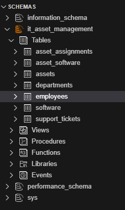
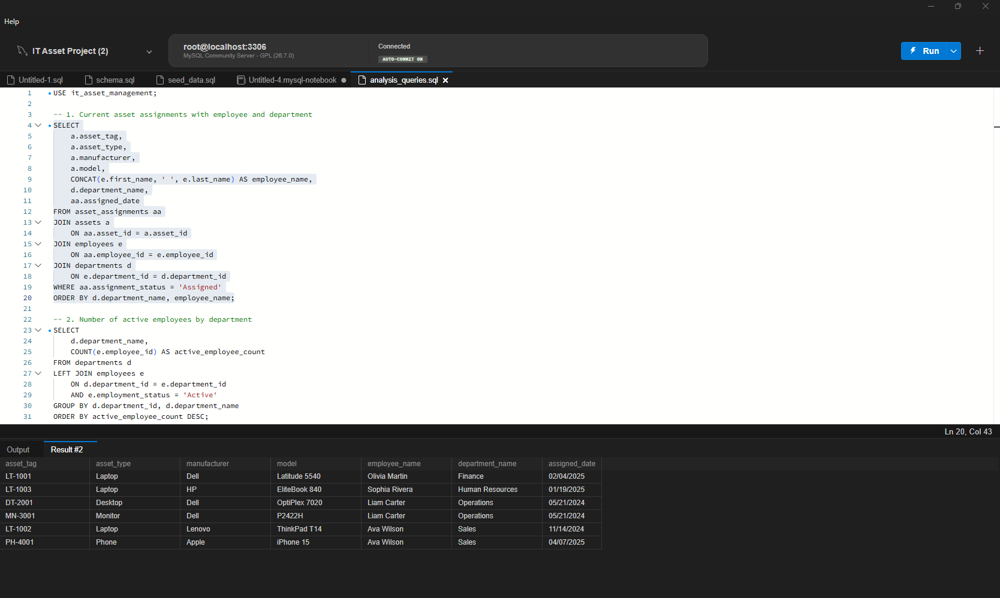
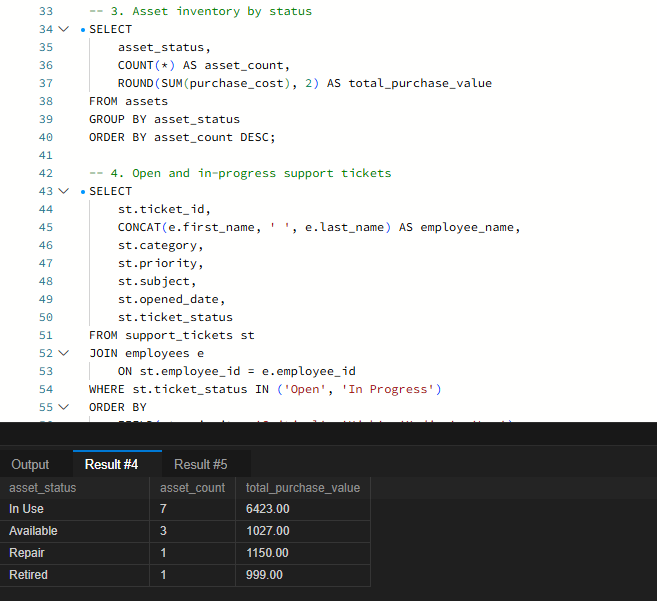
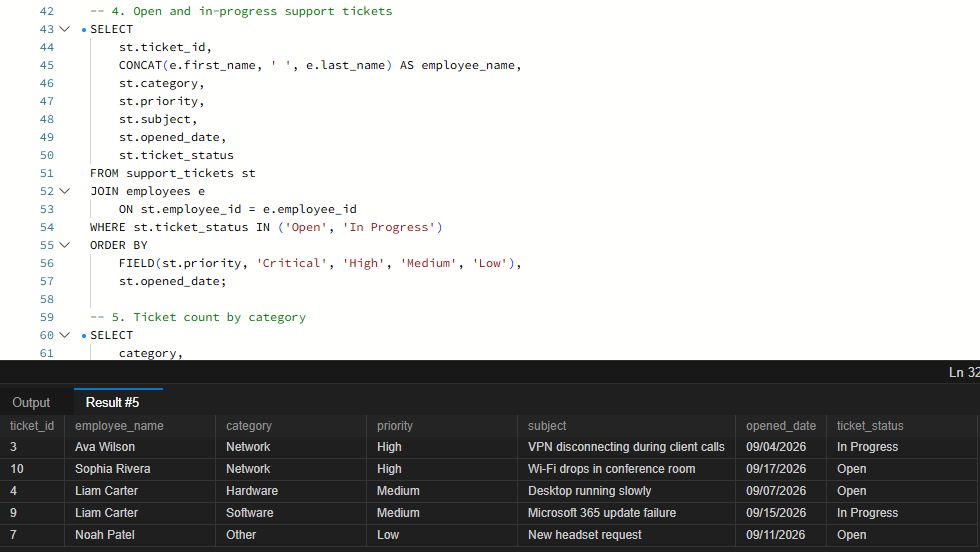

# IT Asset Management Database

## Project Overview
This project simulates an internal IT asset management system for a mid-sized company. The database helps the IT department track employees, departments, devices, software, equipment assignments, and support tickets.

## Business Problem
The fictional company currently tracks laptops, monitors, software, and support requests in separate spreadsheets. This creates problems such as:

- Duplicate asset records
- No clear ownership history
- Difficulty identifying overdue or unresolved support tickets
- Poor visibility into device status
- Inconsistent reporting across departments

The goal of this project is to design a centralized relational database that makes IT asset tracking more accurate and easier to report on.

## Tools
- MySQL 8.0
- SQL
- Relational database design
- Data analysis
- Business reporting

## Core Tables
- departments
- employees
- assets
- software
- asset_assignments
- asset_software
- support_tickets

## Skills Demonstrated
- Database normalization
- Primary and foreign keys
- One-to-many relationships
- Many-to-many relationships
- JOINs
- GROUP BY
- Aggregate functions
- CASE expressions
- Subqueries
- Reporting queries
- Business-focused SQL analysis

## Portfolio Talking Points
Be ready to explain:
1. Why each table exists.
2. How the tables relate to one another.
3. Why asset/software relationships require a junction table.
4. How foreign keys protect data quality.
5. What business questions the reporting queries answer.
6. What you would add if the system were used in production.

## Suggested Improvements
Future improvements could include:
- Asset depreciation
- Warranty expiration alerts
- Vendor tracking
- Software license counts
- Employee offboarding workflows
- Ticket SLA tracking
- A Power BI or Tableau dashboard connected to the database

## Files
- `schema.sql` — creates the database and tables
- `seed_data.sql` — inserts sample company data
- `analysis_queries.sql` — portfolio-ready business queries
## Project Screenshots

### Database Structure
Seven relational tables make up the IT asset management system.

### Current Asset Assignments
This query uses multiple JOINs to connect assets, employees, departments, and assignment records.

### Asset Inventory Summary
This query uses COUNT, SUM, and GROUP BY to show the number and total purchase value of assets by status.

### Open Support Tickets
This query displays unresolved support tickets and prioritizes them by severity.

